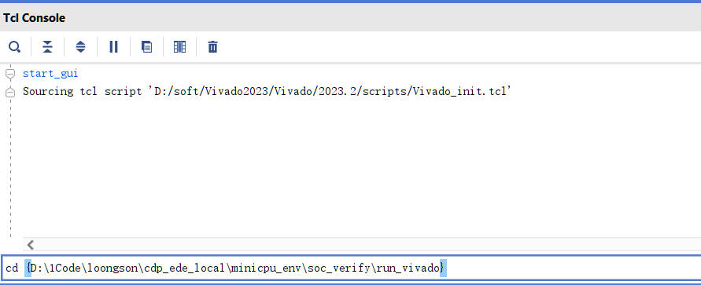
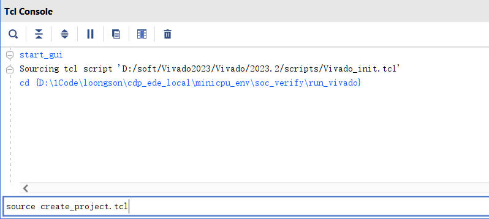
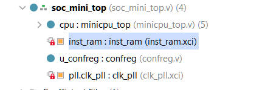
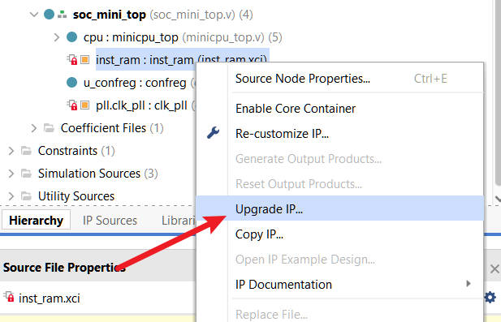
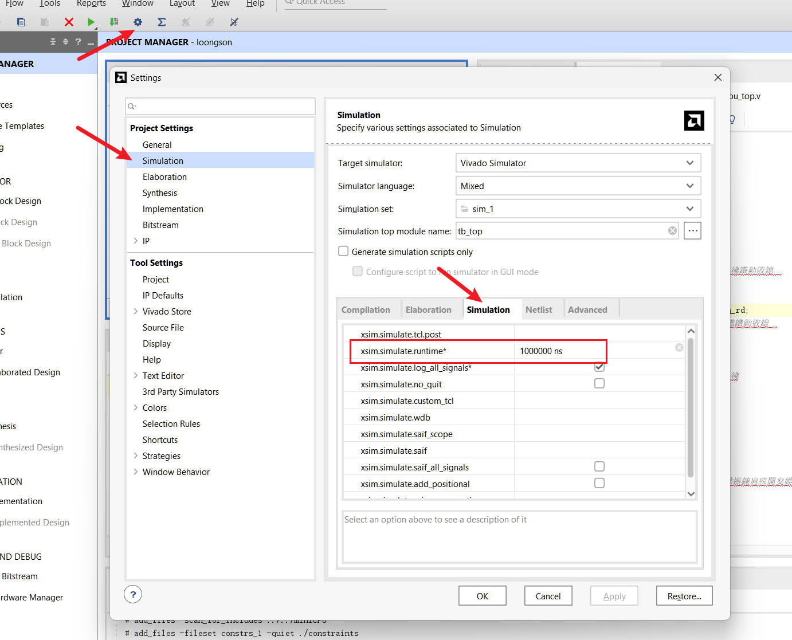

# 实验5：5条指令单周期CPU

!!! info "原书参考"

    [《CPU设计实战：LoongArch版》4.1 验证5条指令的单周期CPU / 4.3.1 实践任务5](https://bookdown.org/loongson/_book3/chapter-single-cycle-cpu.html#sec-verify-5insts-single-cycle-cpu)

## 实验目标

- 理解单周期 CPU 的数据通路：取指 → 译码 → 执行 → 访存 → 写回在一个周期内完成。
- 熟悉实验开发环境（minicpu_env）的组织结构与使用流程。
- 能够仿真、上板一个支持 5 条指令的单周期 CPU，能运行一个简单测试程序。

## 环境介绍

整个 **minicpu_env** 实验开发环境的目录结构及各部分功能简介如下所示：
```
|--miniCPU/             所实现CPU的RTL代码
|  |--minicpu_top.v     5条指令单周期CPU顶层模块
|  |--regfile.v         CPU中寄存器堆模块
|  |--tools.v           CPU中基本功能模块
|
|--func/                功能验证测试程序
|  |--inst_ram.coe      测试程序对应上板用的二进制纯数据文件
|  |--inst_ram.mif      测试程序对应功能仿真用的二进制纯数据文件
|  |--inst_ram.txt      测试程序汇编代码说明
|
|--soc_verify/          所实现的CPU的验证环境
   |--rtl/              验证用SoC设计代码目录
   |  |--soc_mini_top.v SoC的顶层文件
   |  |--CONFREG/       confreg模块，用于访问实验板上的LED灯、拨码开关等外设
   |  |--xilinx_ip/     定制的Xilinx IP，包含clk_pll、inst_ram
   |
   |--testbench/        功能仿真验证平台
   |
   |--run_vivado/       Vivado工程的运行目录
      |--constraints/   Vivado工程设计的约束
```
从现在开始，**你无需手动创建Vivado工程，我们在实验环境中为你提供了创建Vivado工程的脚本！** `soc_verify/run_vivado/create_project.tcl`脚本可以实现一键创建Vivado工程！

1.打开Vivado，在下方的Tcl Console中先进入**miniCPU/soc_verify/run_vivado**目录。


!!! note
    在Linux路径中分隔符为`/`,而Windows系统中路径中分隔符为`\`,Vivado的TCL仅支持Linux形式，请一定记住在Windows下为路径加上花括号`{}`！

2.使用`source`命令执行`create_project.tcl`脚本，等待创建Vivado工程完毕，项目文件是`minicpu_env/soc_verify/run_vivado/project/` 目录下的 `loongson.xpr`。
```
source create_project.tcl
```


3.完成工程创建后请一定检查项目`Top`是否设置正确，仿真时间是否足够长，IP核是否需要升级版本。

!!! tips "如何升级IP核"
    当我们创建工程后，会看到IP核处有一个红色的锁标志，这表明创建当前IP核的Vivado版本低于我们使用的版本，请右键点击upgrade IP升级IP核。

     

??? tips "仿真时间长度"
    当我们遇到Vivado中仿真只运行1000ns就结束时，请增大Vivado项目的仿真时间，按下图方式操作即可。可以换用`ms`,`s`等单位！

    


## 实验内容
阅读并理解实验环境中提供的代码，**补充代码中缺失的部分**，使设计可以通过仿真和上板验证。


## 实验步骤

1. 在 `minicpu_env/soc_verify/run_vivado/` 目录下打开miniCPU工程。
2. 对miniCPU工程中的`inst_ram`重新定制，选择对应func的coe文件（`minicpu_env/func/`inst_ram`.coe`）。
3. 运行miniCPU工程的仿真（进入仿真界面后，直接点击run all），开始调试。可以修改 `minicpu_env/soc_verify/testbench/` 目录下的`minicpu_tb.v`文件中的switch值观察led输出值是否符合预期（每次修改switch值之后都要重新仿真）。（因为本实验的测试程序为斐波那契数程序，斐波那契数列是：0，1，1，2，3，5，……从第三项开始，每一项都等于前两项之和。**规定数列第三项为f(1),即f(1)=1，f(2)=2,f(3)=3,f(4)=5, …… 。**修改拨码开关switch值相当于修改n，led输出值对应f(n)。
4. myCPU仿真通过后，综合实现后生成bit流文件，进行上板验证。

## 验收标准

- [ ] 仿真通过给定的测试程序,led输出值符合斐波那契数程序正确值。
- [ ] 上板后修改拨码开关switch值能够在led显示正确的斐波那契数结果。
