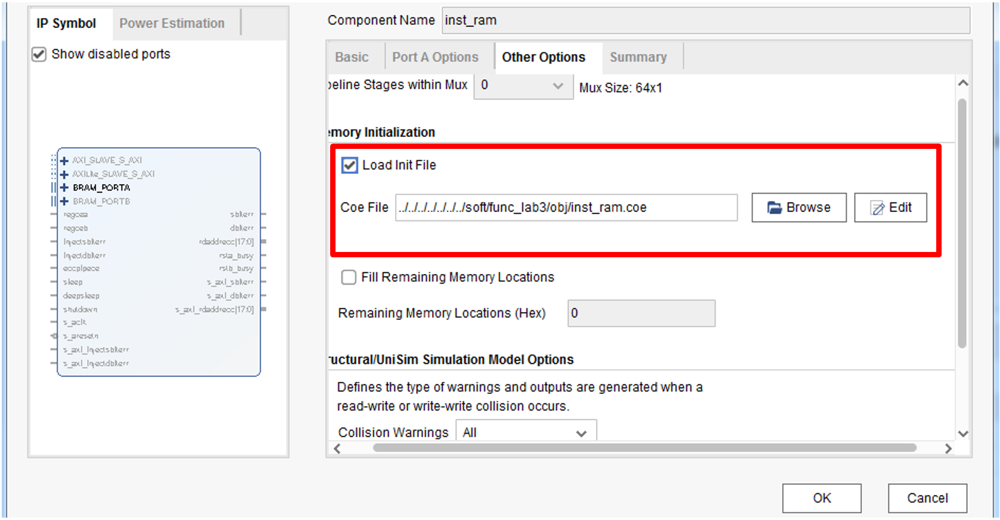

# 实验6：20条指令单周期CPU

!!! info "原书参考"

    [《CPU设计实战：LoongArch版》4.2 验证20条指令的单周期CPU / 4.3.2 实践任务6](https://bookdown.org/loongson/_book3/chapter-single-cycle-cpu.html)

## 实验目标

- 将单周期 CPU 从五条指令扩展到 20 条指令，覆盖算术、逻辑、移位、比较、分支、访存的完整子集。
- 掌握 mycpu_env 实验开发环境的组织结构与实验流程。
- 学会使用**基于 trace 比对**的自动化调试方法，并用 func 功能测试程序验证 CPU 正确性。


## 环境介绍
接下来我们将使用`mycpu_env`环境，后续实验都在该文件夹下。 不用一上来把这些内容都掌握，只需要根据实验进度逐步掌握新的内容即可。`mycpu_env` 目录下没有列出的部分与现阶段的实践任务没有关系，会在后面相关的实验任务中再介绍。

升级后的实验开发环境位于一级子目录 mycpu_env 下，其目录结构及各部分功能简介如下所示：
```
|--gettrace/                生成参考trace的部分。
|  |--src/                  设计代码目录。
|  |  |--tb_top.v           仿真顶层，该模块会抓取debug信息生成到golden_trace.txt中。
|  |  |--soc_lite_top.v     SoC_Lite的顶层文件。
|  |  |--refCPU/            产生比对trace的参考处理器核设计。
|  |  |--CONFREG/           confreg模块，用于访问CPU与开发板上数码管、拨码开关等外设。
|  |  |--BRIDGE/            1×2的桥接模块，CPU的data sram接口同时访问confreg和data_ram。
|  |--gettrace.xpr          Vivado工程文件。
|  |--golden_trace.txt      运行func测试程序所生成的参考trace。需自行生成。
|
|--func/                    实验任务所用的功能验证测试程序。
|  |--include/              功能验证测试程序共享的头文件所在目录。
|  |  |--sysdep.h           一些GCC通用的宏定义的头文件。
|  |  |--asm.h              LoongArch汇编需用到的一些宏定义的头文件，比如LEAF(x)。
|  |  |--regdef.h           LoongArch32 ABI下，32个通用寄存器的汇编助记定义。
|  |  |--cpu_cde.h          SoC_Lite相关参数的宏定义，如访问数码管的confreg的基址。
|  |  |--inst_test.h        各功能测试点的验证程序使用的宏定义头文件
|  |--inst/                 各功能测试点的汇编程序文件。
|  |  |--Makefile           子目录里的Makefile，会被上一级目录中的Makefile调用。
|  |  |--n*.S               各功能测试点的验证程序，汇编语言编写。
|  |--obj/                  功能验证测试程序编译结果存放目录
|  |  |--*                  详见后面小节的说明。
|  |--start.S               功能验证测试的引导代码及主函数。
|  |--Makefile              编译功能验证测试程序的Makefile脚本
|  |--bin.lds               编译bin.lds.S得到的结果，可被make reset命令清除
|  |--convert.c             生成coe和mif文件的处理工具的C程序源码
|
|--myCPU/                   自己实现的CPU的RTL代码。
|
|--soc_verify/              自己实现的CPU的SoC系统验证环境
   |--soc_dram/             CPU对外连接distributed RAM接口时对应的验证环境。
   |  |--rtl/               SoC_Lite设计代码目录。
   |  |  |--soc_lite_top.v  SoC_Lite的顶层文件。
   |  |  |--CONFREG/        confreg模块，用于访问CPU与开发板上数码管、拨码开关等外设。
   |  |  |--BRIDGE/         1×2的桥接模块， CPU的data sram接口同时访问confreg和data_ram。
   |  |  |--xilinx_ip/      定制的Xilinx IP，包含clk_pll、inst_ram、data_ram。
   |  |--testbench/         功能仿真验证平台。
   |  |  |--mycpu_tb.v      功能仿真顶层，该模块会抓取debug信息与golden_trace.txt进行比对。
   |  |--run_vivado/        Vivado工程的运行目录。
   |     |--constraints/    Vivado工程设计的约束。
   |     |--mycpu_dram_prj/ Vivado工程文件所在目录。
```
实验六我们只需要用到`mycpu_env/soc_verify/soc_dram`目录！创建Vivado脚本也在对应`run_vivado`文件夹下，使用方式与实验五相同，这里不再赘述。

## 实验内容

我们已经在环境中提供了一个支持五条指令的单周期CPU，请你**扩展该CPU实现以下20条指令：**

- 算术运算：**add.w, sub.w, addi.w**
- 比较运算：**slt, sltu**
- 逻辑运算：**nor, and, or, xor**
- 移位运算：**slli.w, srli.w, srai.w**
- 访存指令：**ld.w, st.w**
- 分支跳转：**jirl, b, bl, beq, bne**
- 其他：**lu12i.w**

!!! info "测试程序请选择EXP6"

## 实验步骤
该实验环境配置较繁琐，请认真对照执行。`soc_verify`下的其他三个环境也是同样的配置方式。

1. 打开WSL2进入Linux下的shell，进入`mycpu_env\func`目录，执行`make EXP=6`，这里的6表明生成实验6的测试程序。
2. 打开`gettrace` 工程——`mycpu_env/gettrace/gettrace.xpr`。（该Vivado工程中的IP核是使用Vivado2019.2创建的，如果使用更高版本的Vivado打开，请参考`实验五实验环境介绍`进行IP核升级。）运行`gettrace` 工程的仿真（进入仿真界面后，直接点击run all等待仿真运行完成），生成新的参考trace文件`golden_trace.txt`（`mycpu_env/gettrace/golden_trace.txt`）。要等仿真运行完成，`golden_trace.txt`才有完整的内容，请手动检查`golden_trace.txt`内有内容。
3. 进入 `mycpu_env/soc_verify/soc_dram/run_vivado/` 目录下启动验证myCPU的工程。如果该目录下尚未创建工程，请使用目录下的`create_project.tcl`脚本创建项目。
4. 对工程中的`inst_ram`重新定制。
5. 在验证myCPU的工程中运行仿真（进入仿真界面后，直接点击run all），进行功能验证与调试，直至仿真测试通过（**仿真测试通过会显示PASS!，错误则会打印第一次与参考核不同的指令PC**）。
6. 在验证myCPU的工程中综合实现后生成bit流文件，进行上板验证。

??? tips "在WSL2中访问Windows下文件夹"
    在路径前加`/mnt/`即可，同时注意应采用`/`分隔符！
    ```
    # 进入 C 盘用户目录
    cd /mnt/c/Users/你的用户名

    # 进入桌面
    cd /mnt/c/Users/你的用户名/Desktop

    # 进入 D 盘某个项目文件夹
    cd /mnt/d/projects/myapp
    ```

??? tips "重新定制`inst_ram`"
    每当我们更新func程序并重新编译后，需要重新定制`inst_ram`使其应用func/obj/目录下的最新内容。

    注意，只有soc_verify下的工程需重新定制`inst_ram`，gettrace下的工程则是在soc_lite_top.v中INST_COE宏定义直接指向了func/obj/目录下的mif文件。重新定制`inst_ram`的流程如下:

    在Sources窗口中找到`inst_ram` IP，双击或者右键后点击”Re-customize IP…”，进入定制界面。
    在弹出的重新定制IP界面中（如图4.7所示）选择Other Options选项卡，勾选Load Init File，并且在Coe File中通过点击“Browse”选择新生成的`inst_ram.coe`，点击OK。
    在弹出的Generate Output Product窗口中点击Generate（根据需要选择global或ooc模式），完成`inst_ram`的重新定制。
    

??? tip "golden_trace与difftest"
    当前我们使用的是通过一个正确的核运行相同的测试程序，生成`golden_trace.txt` 文件，再将其与我们设计的核进行对比，若完全一致则可以认为我们的核正确运行了对应的测试程序。

    不过golden_trace验证核正确性的方法目前已不再广泛使用，目前更多使用**差分测试（Difftest）**的方式进行核正确性的验证。有感兴趣的同学可以访问香山处理器官方文档详细了解[DiffTest](https://docs.xiangshan.cc/zh-cn/latest/tools/difftest/)

## 实验提示
- 请参考[Loongarch32r精简指令集手册](https://www.loongson.cn/uploads/images/2023041918122813624.%E9%BE%99%E8%8A%AF%E6%9E%B6%E6%9E%8432%E4%BD%8D%E7%B2%BE%E7%AE%80%E7%89%88%E5%8F%82%E8%80%83%E6%89%8B%E5%86%8C_r1p03.pdf)实现实验要求指令。
- 请注意信号的位宽，避免出现信号被截断的离奇bug！！！

## 验收标准

- [ ] 测试6 仿真全部通过，仿真输出PASS；
- [ ] 上板运行后两个LED灯均为绿色，且数码管显示`1400 0014`；

!!! info "上板判断正确的方式"
    在FPGA上板验证时其结果正确与否的判断只有一种方法，测试程序正确的执行行为是：

    1.开始，单色LED全灭，双色LED灯一红一绿，数码管显示全0；

    2.执行过程中，单色LED全灭，双色LED灯一红一绿，数码管高8位和低8位同步累加；

    3.结束时，单色LED全灭，双色LED灯亮两绿，数码管高8位和低8位数值相同，对应测试功能点数目，例如：3A 00 00 3A。

    如果测试程序执行过程中出错了，则数码管高8位和低8位第一次不同处即为测试出错的功能点编号，且最后的结果是单色LED全亮，双色LED灯亮两红，数码管高8位和低8位数值不同。

    另外，可通过修改拨码开关switch值调整程序执行速度，从而看到完整的数码管数字递增。


